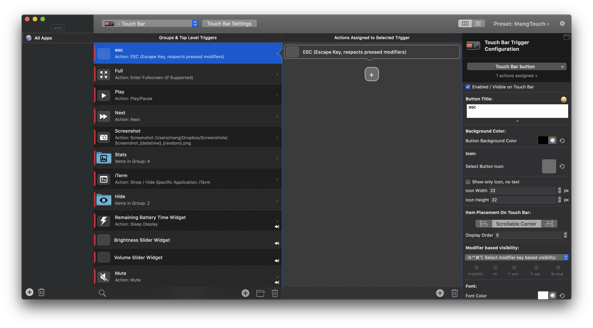

# MangTouchBar

Clean Touch Bar customization using Better Touch Tool

## Features
- "Hide" submenu minimizes distraction (e.g. when watching videos)
- Stats menu (from https://github.com/marekkaczkowski/Touch-Bar-iStats)
- Minimalist brightness / volume / mute
- Touching battery widget sleeps display
- Minimalist icons from Icons8 http://icons8.com
- Button to show/hide iTerm https://www.iterm2.com/
- Use Fn key to toggle between BTT and stock Touch Bar

## Screenshots
Main:

Hide:

Stats:

## Installation

1. Clone or download this repo
2. Install BetterTouchTool
2. Import MangTouch.bttpreset
3. Enable the virtual escape key if necessary (Enabled / Visible on Touch Bar)

4. (Optional) For stats (cpu/gpu temperature, fan RPM) install [iStats ruby gem](https://github.com/Chris911/iStats) with `sudo gem install iStats`

After you import the preset the General Touchbar Settings should be as follows:

